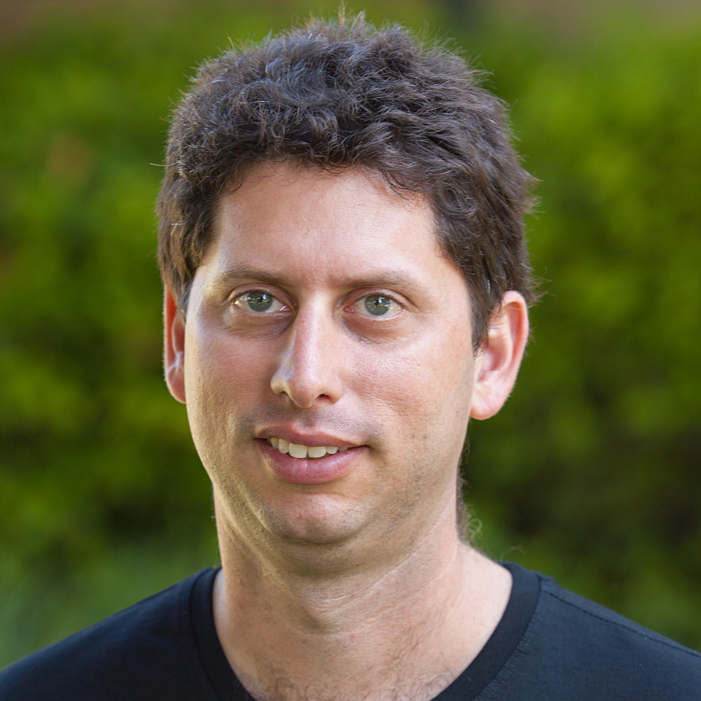

# Hi!

My name is Adam Matan, Engineering Manager at [Compass](https://compass.com).

# What do I do?
I am an R&D manager, developer, and public speaker. My teams build end-to-end apps using modern cloud tools and AI. I love owning delivery, team building, and dev-management-product communication.

# Experience
VP R&D at [craft.io](https://craft.io/), R&D Manager at [Zoomin Software](https://www.zoominsoftware.com/), R&D Manager at [Wix.com](https://wix.com), DevRel and Developer at [Reshuffle](https://www.reshuffle.com/) ([acquired by Twitter](https://www.calcalistech.com/ctech/articles/0,7340,L-3901231,00.html)), CTO at [Vioozer](https://www.vioozer.com/), IFS/BE Developer at [Waze](https://en.wikipedia.org/wiki/Waze) ([acquired by Google](https://techcrunch.com/2013/06/11/its-official-google-buys-waze-giving-a-social-data-boost-to-its-location-and-mapping-business/?guccounter=1&guce_referrer=aHR0cHM6Ly93d3cuZ29vZ2xlLmNvbS8&guce_referrer_sig=AQAAAHTNX635CPdjp1OqIHF4PcGDjZUMni-JXVDjeI_gypkT2opySEGfmhJOl4rK9ArxIs7Giy4_cmgyqYmy9HnuIK1acXhaODxyo_4ckagF_m4BvqcDmtcSx4Or5JbU7pweXL9sloSsi1e0cpKxJrej6iV6JaMj-6v-jBwH3hAO-NC-)), BE developer at [Yahoo!](https://techcrunch.com/2010/10/05/yahoo-dapper/).

# What do I bring to the table?

* Experience leading groups of 15+ developers from various disciplines
* Great communication skills reducing the noise and friction between devs, PMs, and leadership
* Team building skills for independent and scalable organizations
* Strong technical capabilities for building robust and modern cloud-based applications (see my [StackOverflow](https://stackoverflow.com/users/story/51197), [Servefault](https://serverfault.com/users/10904/adam-matan), and [GIS Stack exchange](https://gis.stackexchange.com/users/382/adam-matan) profiles).

# Contact me
adam@matan.name

# Read more
* [CV](Adam_Matan.pdf)
* [Stack Overflow profile](https://stackoverflow.com/users/51197/adam-matan)
* [Linkedin profile](https://www.linkedin.com/in/adamatan/)
* [Public speaking experience](https://adamatan.github.io/cfp/)
